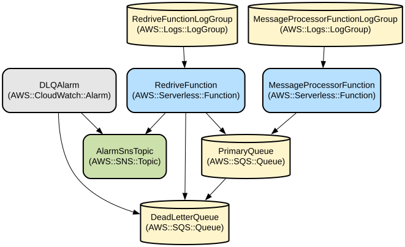
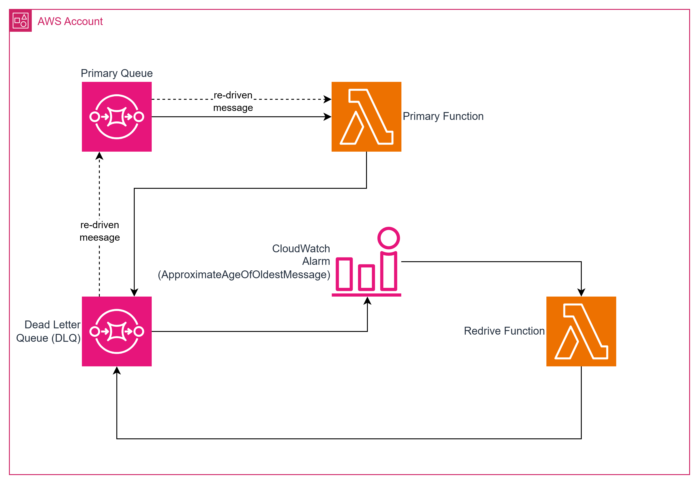

# Automated SQS Dead-Letter Queue Redrive System

This project implements an automated message redrive system for AWS SQS queues that automatically recovers failed messages from a Dead-Letter Queue (DLQ) back to the primary processing queue. The system uses CloudWatch alarms to monitor message age and trigger reprocessing, ensuring no messages are permanently lost.

The system consists of two main components: a message processor that handles incoming SQS messages and a redrive processor that automatically moves failed messages back to the primary queue when triggered by CloudWatch alarms. This architecture provides resilient message processing with automated recovery capabilities, making it ideal for systems requiring reliable message handling with automatic failure recovery.

## Repository Structure
```
.
├── MessageProcessorFunction/          # Primary message processing Lambda function
│   ├── src/                          # Source code for message processing
│   └── pom.xml                       # Maven configuration for message processor
├── RedriveFunction/                  # DLQ redrive Lambda function
│   ├── src/                          # Source code for redrive mechanism
│   └── pom.xml                       # Maven configuration for redrive function
└── template.yaml                     # AWS SAM template defining infrastructure
```

## Usage Instructions
### Prerequisites
- Java Development Kit (JDK) 17 or later
- Apache Maven 3.8 or later
- AWS CLI v2
- AWS SAM CLI
- An AWS account with appropriate permissions
- AWS credentials configured locally

### Installation

1. Clone the repository:
```bash
git clone <repository-url>
cd dlq-auto-redrive-by-cloudwatch
```

2. Build the project:
```bash
sam build
```

3. Deploy to AWS:
```bash
sam deploy --guided
```

During the guided deployment, you'll need to:
- Specify a stack name
- Choose an AWS region
- Confirm IAM role creation
- Configure other deployment parameters as prompted

### Quick Start

1. Send a test message to the primary queue:
```bash
aws sqs send-message \
  --queue-url <PRIMARY_QUEUE_URL> \
  --message-body "Hello World"
```

2. Monitor message processing:
```bash
aws logs tail /aws/lambda/MessageProcessorFunction --follow
```

3. To simulate a failure, send a message containing "fail":
```bash
aws sqs send-message \
  --queue-url <PRIMARY_QUEUE_URL> \
  --message-body "fail test"
```

### More Detailed Examples

1. Monitoring DLQ message age:
```bash
aws cloudwatch get-metric-statistics \
  --namespace AWS/SQS \
  --metric-name ApproximateAgeOfOldestMessage \
  --dimensions Name=QueueName,Value=<DLQ_NAME> \
  --start-time $(date -u -v-1H +%FT%TZ) \
  --end-time $(date -u +%FT%TZ) \
  --period 300 \
  --statistics Maximum
```

2. Manual redrive trigger:
```bash
aws sns publish \
  --topic-arn <ALARM_SNS_TOPIC_ARN> \
  --message "Manual redrive trigger"
```

### Troubleshooting

1. Message Processing Failures
- Problem: Messages repeatedly failing processing
- Solution: 
  ```bash
  # Check message processor logs
  aws logs tail /aws/lambda/MessageProcessorFunction --since 1h
  ```

2. Redrive Not Triggering
- Problem: Failed messages not being redriven
- Solution:
  ```bash
  # Verify CloudWatch alarm state
  aws cloudwatch describe-alarms --alarm-names DLQOldestMessageAlarm
  
  # Check redrive function logs
  aws logs tail /aws/lambda/RedriveFunction --since 1h
  ```

## Data Flow
The system processes messages through a primary queue with automatic failure handling and recovery through a DLQ. When messages fail processing, they are automatically moved to the DLQ and later redriven back to the primary queue based on age thresholds.

```ascii
[Primary Queue] --> [MessageProcessor] --> [Success/Failure]
                          |
                          v
                    [DLQ (on failure)] 
                          |
                          v
[CloudWatch Alarm] --> [RedriveProcessor] --> [Back to Primary Queue]
```

Key component interactions:
1. MessageProcessor receives messages from the primary queue
2. Failed messages are moved to DLQ after 3 retries
3. CloudWatch monitors message age in DLQ
4. Alarm triggers when messages exceed 5-minute age threshold
5. RedriveProcessor moves messages back to primary queue
6. System maintains message ordering during redrive process
7. Automatic scaling based on queue length

## Infrastructure





### SQS Queues
- Primary Queue (AWS::SQS::Queue)
  - 60-second visibility timeout
  - Configured with redrive policy
- Dead Letter Queue (AWS::SQS::Queue)
  - 4-day message retention
  - Monitored by CloudWatch

### Lambda Functions
- MessageProcessorFunction (AWS::Serverless::Function)
  - Processes messages from primary queue
  - Java 17 runtime
  - 512MB memory, 60-second timeout
- RedriveFunction (AWS::Serverless::Function)
  - Handles message redrives
  - Triggered by SNS notifications
  - Full SQS permissions for message movement

### Monitoring
- DLQAlarm (AWS::CloudWatch::Alarm)
  - Monitors oldest message age
  - 5-minute threshold
  - Triggers SNS notification
- AlarmSnsTopic (AWS::SNS::Topic)
  - Receives alarm notifications
  - Triggers redrive function